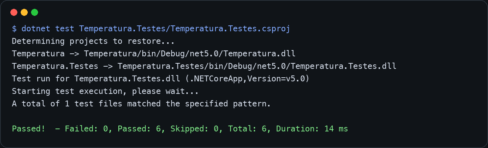
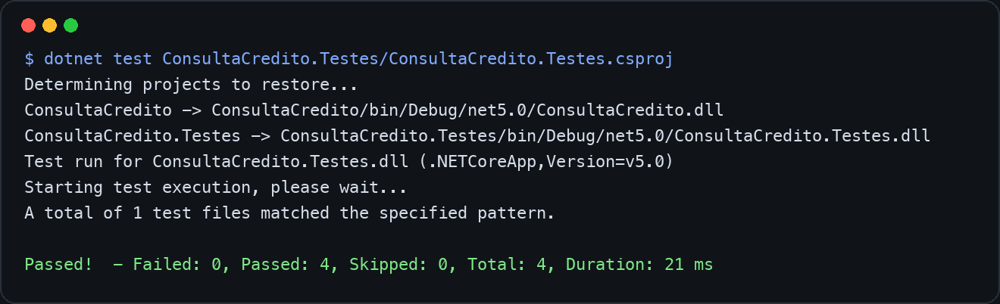
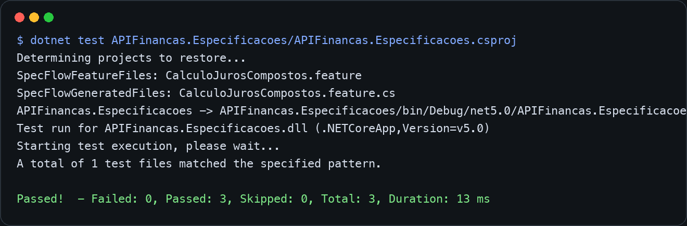

# Ponderada Aplicando Testes Renan

Repositório criado para aplicar os três tipos de testes apresentados no tutorial [Testes de Software com .NET 5: exemplos de utilização](https://renatogroffe.medium.com/testes-de-software-com-net-5-exemplos-de-utiliza%C3%A7%C3%A3o-9b5514119ba2)

## Como executar

Para executar os testes é necessário ter o SDK do .NET 5 instalado na máquina. Depois de clonar o repositório, acesse a pasta do projeto:

```bash
git clone https://github.com/Renan-Coding/aplicando-testes.git
cd aplicando-testes
```

Execute cada projeto de teste separadamente para validar os três tipos apresentados no tutorial:

Teste de unidade com xUnit:

```bash
dotnet test Temperatura.Testes/Temperatura.Testes.csproj
```

Teste com Mock Object usando Moq e FluentAssertions:

```bash
dotnet test ConsultaCredito.Testes/ConsultaCredito.Testes.csproj
```

Teste BDD com SpecFlow:

```bash
dotnet test APIFinancas.Especificacoes/APIFinancas.Especificacoes.csproj
```

Ao final de cada comando, o terminal deve exibir `Passed!`, indicando que todos os testes daquele projeto foram executados com sucesso. Os prints adicionados neste README foram tirados exatamente dessas execuções no terminal.

## Testes de Unidade

Testes de unidade validam uma menor parte isolada da aplicação. Aqui, o método `FahrenheitParaCelsius` é testado com xUnit usando `Theory` e `InlineData`, permitindo executar o mesmo teste para várias entradas e saídas esperadas.

Cenário 1: ao informar `32` Fahrenheit, o resultado esperado é `0` Celsius.

Cenário 2: ao informar `212` Fahrenheit, o resultado esperado é `100` Celsius.

Print do teste executado:



## Mock Objects

Mock objects simulam dependências externas para testar a regra de negócio sem depender de serviços reais. Neste projeto, a interface `IServicoConsultaCredito` é simulada com Moq, e o resultado da classe `AnaliseCredito` é validado com FluentAssertions.

Cenário 1: quando o serviço retorna `null` para um CPF inválido, o status esperado é `ParametroEnvioInvalido`.

Cenário 2: quando o serviço retorna uma lista vazia de pendências, o status esperado é `SemPendencias`.

Print do teste executado:



## SpecFlow

SpecFlow permite escrever testes no formato BDD, descrevendo o comportamento esperado em uma linguagem próxima da regra de negócio. Neste projeto, a funcionalidade de cálculo de juros compostos é descrita em um arquivo `.feature`, e cada frase do cenário é vinculada a métodos C# na Step Definition.

Cenário 1: para empréstimo de `10.000,00`, prazo de `12` meses e taxa de `2,00%`, o valor final esperado é `12.682,42`.

Cenário 2: para empréstimo de `11.937,28`, prazo de `24` meses e taxa de `4,00%`, o valor final esperado é `30.598,88`.

Print do teste executado:


